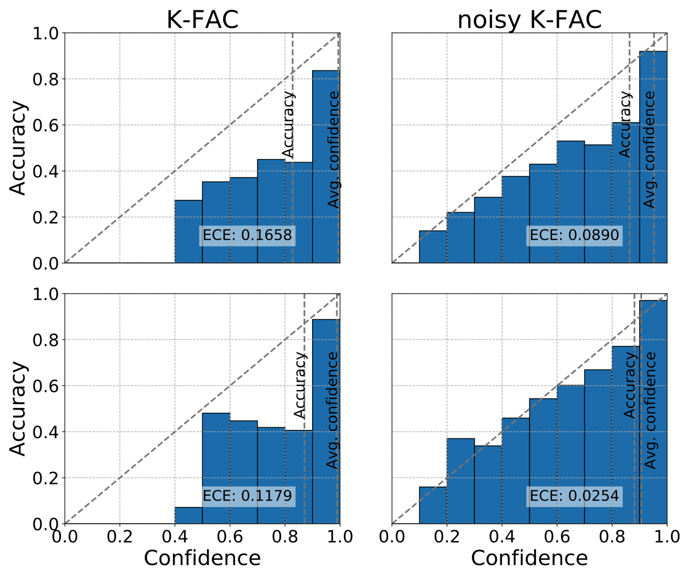

# noisy K-FAC

The major contributors of this repository include [Guodong Zhang](https://github.com/gd-zhang) and [Shengyang Sun](https://github.com/ssydasheng).

## Introduction
This repository contains the code to reproduce the classification results from the paper Noisy Natural Gradient as Variational Inference ([Paper](https://arxiv.org/abs/1712.02390), [Video](https://www.youtube.com/watch?v=bWItvHYqKl8)).

Noisy Natural Gradient: Variational Inference can be instantiated as natural gradient with adaptive weight noise. By further approximating full Fisher with [K-FAC](https://arxiv.org/abs/1503.05671), we get noisy K-FAC, a surprisingly simple variational training algorithm for Bayesian Neural Nets. Noisy K-FAC not only improves the classification accuracy, but also gives well-calibrated prediction. 



Now, the implementation of convolution with multiple samples (which is very useful for Bayesian Neural Nets) is messy and slow, we plan to implement a new operation in tensorflow after NIPS.

## Citation
To cite this work, please use
```
@article{zhang2017noisy,
  title={Noisy Natural Gradient as Variational Inference},
  author={Zhang, Guodong and Sun, Shengyang and Duvenaud, David and Grosse, Roger},
  journal={arXiv preprint arXiv:1712.02390},
  year={2017}
}
```

## Dependencies
This project uses Python 3.5.2. Before running the code, you have to install
* [Tensorflow 1.4+](https://www.tensorflow.org/)
* [PyTorch](http://pytorch.org/)
* [Numpy](http://www.numpy.org/)
* [tqdm](https://pypi.python.org/pypi/tqdm)

## Example
```
python main.py --config config/kfac_plain.json
```

## Tensorboard Visualization
This implementation allows for the beautiful Tensorboard visualization. All you have to do is to launch Tensorboard from your experiment directory located in `experiments/`.
```
tensorboard --logdir=experiments/cifar10/noisy-kfac/summaries
```
